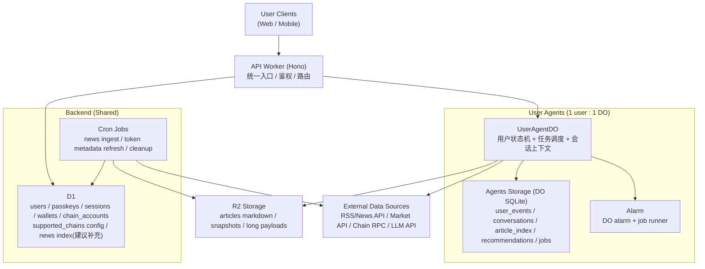

# Agentic Wallet Architecture (Refined)

## 1. 目标与原则
- 每个用户拥有独立 Agent 上下文（1:1 隔离）。
- 公共后端负责认证、链能力、全局配置与公共数据索引。
- 用户私有状态优先放在 `UserAgentDO`（强隔离、低延迟、串行一致）。
- 长文本与可回溯内容放在 `R2`，结构化索引放在 `DO SQLite / D1`。
- 默认“可降级运行”：外部数据源异常时，仍可返回最近可用结果。

## 2. 总体架构（对应你的草图）

## 3. 组件职责

### 3.1 User Clients
- 登录/注册：Passkey（WebAuthn）。
- 业务调用：通过 `Bearer session token` 访问 `/v1/*`。
- 行为上报：资产浏览、收藏、交易意图、停留等事件写入 `/v1/agent/events`。
- 内容消费：拉取日报、专题、推荐，支持刷新与反馈。

### 3.2 API Worker（共享入口）
- 路由与鉴权：统一处理 `public/protected` 路由。
- 用户绑定：鉴权后仅将当前 `userId` 映射到对应 `UserAgentDO`。
- DO 代理层：通过 `idFromName(userId)` 保证 1:1 用户 Agent 实例。
- 兼容兜底：DO 不可用时可回退部分 D1 数据（当前推荐接口已具备此思路）。

### 3.3 UserAgentDO（每用户独立）
- 用户私有状态：事件、会话、推荐、文章索引、任务队列。
- 任务执行器：`daily_digest / recommendation_refresh / topic_generation / cleanup`。
- 幂等控制：事件 `dedupe_key`、任务 `job_key` 去重。
- 读取体验：`getTodayDaily` 触发“缺失即补跑”。

### 3.4 Backend / D1（全局共享）
- 已有核心表：`users / passkeys / sessions / wallets / wallet_chain_accounts`。
- 公共能力：
  - 登录凭据与会话管理（WebAuthn + session）。
  - 支持链与默认币种配置（当前在配置文件，可按需入库）。
  - 运营统计与跨用户聚合（建议新增聚合表）。
- 建议补充表：
  - `news_index`：全局新闻去重、标签、时效字段。
  - `token_catalog`：symbol、chain_id、contract、logo、状态。

### 3.5 R2 Storage
- 存放文章正文（Markdown）与大型对象，避免 D1/DO 承载长文本。
- 推荐路径规范：
  - `articles/{user_id}/{yyyy-mm-dd}/daily-{article_id}.md`
  - `articles/{user_id}/{yyyy-mm-dd}/topic-{slug}-{article_id}.md`
- 读路径优先 DO 索引 -> R2 key -> 回源正文。

### 3.6 External Data Source
- 新闻：RSS 或 News API（当前已有 RSS 拉取逻辑）。
- 行情/资产：第三方 market/portfolio API。
- 链上：RPC（Ethereum/Base/BNB）。
- 生成：LLM（当前 OpenAI-compatible）。

## 4. 数据分层与边界

### 4.1 数据分层
- L0（用户敏感核心）：钱包私钥、会话、凭据元数据。
- L1（用户行为与偏好）：事件流、会话上下文、推荐反馈。
- L2（内容层）：日报/专题正文、摘要、标签。
- L3（公共知识层）：新闻索引、token/chain 元数据。

### 4.2 存储建议
- 私钥：仅存加密密文，不在日志/事件中出现明文。
- Passkey：仅保存必要公钥与计数器，不保存生物特征数据。
- 聊天与事件：按 TTL 或归档策略做分层保留。
- 文章正文：R2 生命周期策略（热数据+冷数据归档）。

## 5. 关键时序

### 5.1 登录与用户绑定
1. 客户端走 WebAuthn 注册/登录。
2. API Worker 在 D1 校验后签发 session token。
3. 受保护请求进入 `/v1/*`，中间件解析 token -> `userId`。
4. Agent 相关请求路由到 `idFromName(userId)` 对应 DO。

### 5.2 事件驱动推荐
1. 客户端上报事件 `/v1/agent/events`。
2. DO 落 `user_events`（去重）。
3. 命中触发条件则入队 `recommendation_refresh`（带 job_key）。
4. alarm/job runner 执行生成，写 `recommendations`。
5. 客户端拉取 `/v1/agent/recommendations`。

### 5.3 每日日报
1. `ensureDailyDigestJobs` 检查当天日报是否存在。
2. 不存在则立即排队；并预排下一个固定时刻任务（如 UTC 08:00）。
3. 任务执行时聚合事件 + 新闻 + LLM 生成内容。
4. 正文写入 R2，索引写入 DO SQLite。
5. `/v1/agent/daily/today` 返回 ready / generating / failed / stale。

## 6. 安全与合规
- 鉴权：所有 `/v1/*` 必须 `requireAuth`，Agent 数据只允许 owner `userId` 访问。
- 密钥管理：
  - 私钥字段保持加密存储（建议引入 KMS/密钥轮换策略）。
  - `APP_SECRET`、LLM key、RPC key 仅放 Worker secret。
- 审计：
  - 关键链路记录 `trace_id / user_id / job_id / event_id`。
  - 对生成结果记录 `model/provider/version`。
- 限流与防滥用：
  - 事件上报限频、聊天与生成接口配额、异常 IP/用户熔断。

## 7. 可靠性与可观测性

### 7.1 可靠性
- 幂等：`dedupe_key`（事件）+ `job_key`（任务）。
- 重试：任务指数退避，超过阈值标记失败并可人工补跑。
- 降级：
  - LLM 不可用 -> fallback 模板内容。
  - 外部新闻不可用 -> 使用已有索引或仅基于用户行为生成。
  - DO 临时失败 -> 返回最近 D1 备份数据（可选）。

### 7.2 可观测性（建议指标）
- 内容：日报生成成功率、时延、打开率、收藏率。
- 推荐：刷新成功率、CTR、反馈负向率、转化率。
- 系统：DO alarm 延迟、队列积压、R2 读写失败率、外部 API 错误率。

## 8. 与当前代码的映射（现状）
- 已落地：
  - `UserAgentDO`（事件、文章、推荐、job runner、alarm）。
  - D1 用户认证/会话/钱包模型。
  - R2 文章正文读写。
  - LLM + RSS 生成链路（含 fallback）。
- 建议下一步：
  1. 新增 `news_index` 与 `token_catalog`（共享数据层）。
  2. 增加 Cron Worker 做全局抓取与预处理，DO 专注用户个性化。
  3. 增加推荐反馈闭环与策略版本化（便于 AB）。
  4. 增加统一 tracing 与 dashboard（按 user/job 粒度排障）。

## 9. MVP 到可上线版本的演进
1. MVP（当前）：单 Worker + DO + D1 + R2，可用优先。
2. v1.1：引入共享 `news_index/token_catalog` + Cron 预处理。
3. v1.2：加入实时通道（WS/SSE）与对话上下文策略。
4. v1.3：完善密钥轮换、风控规则、灰度与 AB 能力。

