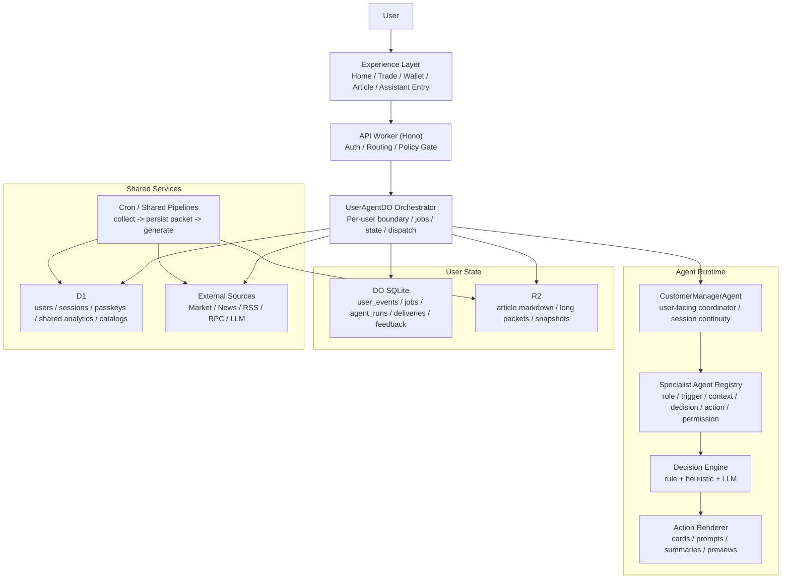

# AgenticWallet Architecture V2

Date: 2026-03-15

## 1. Goal

`AgenticWallet` 的 V2 架构目标，不是把 Agent 藏起来，而是把它放在正确的位置：

- 用户侧可以明确看到并使用一个专门的助手入口，并把它理解为自己的“客户经理”。
- 产品的大部分价值不应只依赖用户主动打开助手，而应自然体现在首页、钱包、交易、文章和异常恢复体验里。
- 内部必须把 Agent 当成一组职责清晰、可观测、可评估、可持续优化的“数字员工”来运行。

一句话说：

- 用户侧是一个客户经理。
- 内部侧是一组专业 agent。

## 2. Design Principles

### 2.1 显式客户经理入口是体验的一部分

- 保留一个明确助手入口，让用户知道自己随时可以获得帮助。
- 这个入口可以被用户理解为自己的专属客户经理。
- 不要求用户理解多 Agent 架构、任务系统或内部协作方式。
- 是否有显式入口，不应影响我们把核心价值做进主流程。

### 2.2 用户侧一个客户经理，内部侧多个专业员工

- 用户面对的是一个统一助手，而不是一组分散角色。
- 内部不应把所有能力都塞进一个“大一统 agent”。
- 更合理的方式是让一个 `CustomerManagerAgent` 统一对外，再由多个专业 agent 提供具体能力。

### 2.3 Agent 价值要同时体现在显式与隐式触点

- 显式触点：助手入口、对话、主动求助、问题解释。
- 隐式触点：首页优先级整理、日报、推荐卡片、风险提示、错误恢复、流程说明。
- 用户不打开助手，也应该能持续感受到产品“被整理过、被照顾过”。

### 2.4 高风险动作继续采用建议优先

- 交易、转账、签名、授权等动作默认由 Agent 给出解释、建议、预览和风险确认。
- 是否执行仍由用户确认。
- 后续如要提升自动化，必须建立在权限边界、可解释性和观测闭环之上。

### 2.5 统一 runtime，避免每个页面各自长逻辑

- 首页卡片、推荐、提醒、错误恢复、聊天助手，不应该各自维护一套独立规则。
- 它们都应该消费同一套 agent runtime，只是在不同触点以不同形式呈现。

## 3. Target Architecture



## 4. Layer Responsibilities

### 4.1 Experience Layer

职责：

- 承载用户可见体验，包括显式助手入口与各页面内联触点。
- 只负责展示和交互，不负责决定“是否该触发提醒、为什么触发、强度多高”。
- 通过统一 API 消费结构化 action。

主要触点：

- `assistant.entry`
- `assistant.chat`
- `home.daily_digest`
- `home.priority_assets`
- `home.topic_cards`
- `trade.recommendation_cards`
- `wallet.transfer_risk_prompt`
- `wallet.error_recovery_hint`
- `article.deep_read_prompt`

### 4.2 API Worker

职责：

- 鉴权。
- 策略闸门与权限检查。
- 把用户请求和事件转发到对应 `UserAgentDO`。
- 保持 HTTP 契约稳定，不把前端绑定到底层 runtime 细节上。

保留：

- `userId -> Durable Object ID` 的 `idFromName(userId)` 映射。
- `/v1/agent/*` 作为统一能力入口。

### 4.3 UserAgentDO Orchestrator

职责：

- 继续作为每个用户唯一的执行边界。
- 负责串行状态、一致性、任务调度、去重、重试、状态归档。
- 不再承担所有业务细节。

V2 中它应该只做三件事：

- 存用户状态。
- 跑 job queue。
- 把 trigger 分发给具体 agent module。

不建议继续强化为“大一统业务对象”。

### 4.4 Agent Runtime

职责：

- 统一定义和执行 Agent 员工能力。
- 支持显式请求和隐式触发两种入口。
- 统一输出 decision 和 action，不直接把页面逻辑写死在 runtime 里。

建议拆成四个子层：

- `CustomerManagerAgent`
- `Agent Registry`
- `Decision Engine`
- `Action Renderer`

### 4.5 CustomerManagerAgent

职责：

- 作为用户侧唯一可感知的“客户经理”。
- 维护会话连续性、语言风格、解释口径和跨页面上下文。
- 接住用户显式请求，并决定应该调用哪个内部专业 agent。
- 聚合多个专业 agent 的结果，再以统一口径返回给用户或产品触点。

它不应该：

- 独自完成所有内容生成、推荐、提醒、风险判断和恢复说明。
- 变成一个无边界的大 prompt 或超大状态对象。

## 5. Agent Runtime Model

## 5.1 Agent Contract

每个 Agent 都应实现统一 contract：

- `id`
- `role`
- `trigger`
- `context`
- `decision`
- `action`
- `permission`
- `evaluation`

建议的 TypeScript 形态：

```ts
type AgentDefinition = {
  id: string;
  role: string;
  triggers: string[];
  permissions: {
    mode: 'suggest_only' | 'safe_auto';
    allowedActions: string[];
  };
  loadContext: (input: AgentRunInput) => Promise<AgentContext>;
  decide: (context: AgentContext) => Promise<AgentDecision>;
  act: (decision: AgentDecision, context: AgentContext) => Promise<AgentActionResult[]>;
  evaluate: (delivery: AgentDelivery, feedback: AgentFeedback[]) => AgentEvaluation;
};
```

## 5.2 First-wave Agents

建议优先采用“1 个客户经理 + 5 个专业 agent”的模式：

### 0. CustomerManagerAgent

职责：

- 统一承接用户显式打开助手、主动提问、追问和跨页面连续对话。
- 负责把用户问题翻译成内部任务，并把内部结果组织成统一回复。
- 负责用户偏好的长期记忆入口，例如语言、风险倾向、提醒强度、关注方向。

输出：

- `assistant_reply`
- `assistant_followup_question`
- `assistant_context_handoff`
- `assistant_action_bundle`

### 1. AssetCurationAgent

职责：

- 负责首页和资产页的重点整理与优先级调整。
- 决定哪些资产、卡片、主题应该被提升曝光。

输出：

- `raise_asset_priority`
- `raise_topic_priority`
- `hide_low_signal_block`
- `promote_watchlist_item`

### 2. ContentSummaryAgent

职责：

- 负责日报、专题、文章压缩摘要。
- 把市场变化和用户持仓、关注、阅读联系起来。

输出：

- `publish_daily_digest`
- `publish_topic_article`
- `publish_article_summary`

### 3. ReminderFollowupAgent

职责：

- 负责价格、波动、持仓变化、页面停留、异常状态后的提醒与跟进。
- 决定是否值得打扰用户。

输出：

- `show_inline_nudge`
- `show_followup_hint`
- `suppress_notification`

### 4. RecommendationGuideAgent

职责：

- 基于用户持仓、浏览、阅读、收藏和交易线索，给出下一步建议。
- 统一服务于推荐卡片和助手对话中的建议能力。

输出：

- `publish_recommendation_cards`
- `show_contextual_suggestion`
- `suggest_transfer_preview`

### 5. SafetyRecoveryAgent

职责：

- 负责链选择解释、地址/资产组合风险、交易失败、广播延迟、余额未刷新等场景的说明与恢复引导。

输出：

- `show_transfer_risk_explainer`
- `show_transaction_pending_explainer`
- `show_recovery_action`
- `show_chain_asset_warning`

## 5.3 Run Pipeline

每次 agent 运行都应形成统一流水：

1. `trigger`
2. `resolve_agent`
3. `load_context`
4. `make_decision`
5. `emit_action`
6. `deliver`
7. `collect_feedback`
8. `evaluate`

这条链路要能被回放、审计和比较。

## 6. Trigger Model

## 6.1 Trigger Categories

### A. Explicit User Request

示例：

- 用户点击助手入口。
- 用户在聊天里主动提问。
- 用户请求解释交易、链、错误或文章。

特点：

- 触发明确。
- 用户预期强。
- 一般先由 `CustomerManagerAgent` 接住，再分派给专业 agent。

### B. Implicit Product Trigger

示例：

- 打开首页时需要整理重点。
- 日报时段到了。
- 推荐过期且用户最近有新活动。
- 资产排序需要调整。

特点：

- 用户不一定主动发起。
- 但结果要自然落到产品体验中。

### C. Event-driven Trigger

示例：

- `asset_viewed`
- `asset_favorited`
- `trade_buy`
- `trade_sell`
- `article_read`
- `page_dwell`
- `transfer_submitted`
- `transfer_failed`
- `transaction_pending_too_long`

特点：

- 需要统一去重、节流和优先级控制。
- 不宜全部实时打断用户，应先进入 runtime 判断。

## 6.2 Trigger Policy

建议增加统一策略：

- `cooldown_policy`
- `priority_policy`
- `dedupe_policy`
- `user_state_policy`
- `risk_policy`

这样可以避免提醒逻辑分散在前端 hook 和各页面组件里。

## 7. Decision and Action Model

## 7.1 Decision First, Action Second

当前很多逻辑直接“生成文章”或“直接弹提示”。

V2 应统一改成：

- 先产出结构化 decision。
- 再根据 permission 和 product slot 产出 action。

示例：

```ts
type AgentDecision = {
  shouldAct: boolean;
  confidence: number;
  reasonCodes: string[];
  summary: string;
  riskLevel: 'low' | 'medium' | 'high';
  recommendedActions: AgentAction[];
};
```

## 7.2 Action Taxonomy

建议统一 action schema，而不是每个页面自己发明：

- `assistant_reply`
- `publish_daily_digest`
- `publish_topic_article`
- `publish_recommendation_cards`
- `raise_asset_priority`
- `show_inline_nudge`
- `show_transfer_risk_explainer`
- `show_recovery_message`
- `suggest_transfer_preview`
- `suggest_trade_review`
- `ask_followup_question`

这些 action 再映射到具体 product slot：

- `assistant.panel`
- `home.hero`
- `home.recommendation_shelf`
- `trade.inline_hint`
- `wallet.modal_explainer`
- `assistant.chat_message`

## 7.3 Permission Model

建议为 action 显式打权限标签：

- `inform_only`
- `suggest_only`
- `safe_auto`
- `blocked`

当前阶段的默认策略：

- 内容生成、排序调整、轻量提示：可自动落地。
- 交易、转账、签名、授权：只建议，不自动执行。

## 8. Data Model Upgrades

现有表：

- `user_events`
- `jobs`
- `article_index`
- `recommendations`
- `portfolio_snapshots_*`
- `transfers`
- `user_watchlist_assets`

这些可以保留，但需要补上 runtime 账本。

## 8.1 New Tables

### `agent_runs`

记录一次 agent 运行的主记录。

字段建议：

- `run_id`
- `agent_id`
- `trigger_type`
- `trigger_ref`
- `user_id`
- `status`
- `started_at`
- `completed_at`
- `trace_id`
- `model_provider`
- `model_name`
- `model_version`
- `prompt_version`

### `agent_run_steps`

记录 `context / decision / action / result` 各步。

字段建议：

- `run_id`
- `step_type`
- `payload_json`
- `created_at`

### `agent_deliveries`

记录 action 落到了哪里、是否成功送达。

字段建议：

- `delivery_id`
- `run_id`
- `action_type`
- `slot`
- `delivery_status`
- `delivered_at`

### `agent_feedback`

记录用户反馈和行为结果。

字段建议：

- `feedback_id`
- `run_id`
- `delivery_id`
- `feedback_type`
- `value`
- `created_at`

### `assistant_sessions`

记录显式助手会话。

### `assistant_messages`

记录会话消息、结构化 action、引用上下文。

### `context_packets`

记录需要跨执行边界持久化的 source packet。

适用场景：

- 多路外部抓取后再调用 LLM。
- 需要重试隔离和复盘的生成流程。

## 8.2 Feedback Normalization

建议把“是否有效”统一收口，不要散落在组件本地状态里。

统一反馈类型：

- `impression`
- `open`
- `click`
- `dismiss`
- `adopt`
- `negative_feedback`
- `ignore`

示例：

- 日报卡片被展示，记 `impression`
- 用户点开文章，记 `open`
- 用户点击推荐资产，记 `click`
- 用户关闭提醒气泡，记 `dismiss`
- 用户按建议发起 transfer preview，记 `adopt`

## 9. Scheduling and Pipeline Boundaries

## 9.1 Job Types

建议将 job type 扩展为：

- `daily_digest`
- `recommendation_refresh`
- `portfolio_snapshot`
- `nudge_evaluate`
- `followup_check`
- `cleanup`

## 9.2 Durable Execution Boundary

对于“先多路抓取外部数据，再进行 LLM 生成”的场景，继续遵循：

- `collect -> persist packet -> generate`

不要把它当作 topic special 的特例，而应升级为全局生成规范。

适用对象：

- 日报
- 专题
- 推荐解释
- 风险说明
- 恢复说明

## 9.3 Shared vs User-local Pipelines

建议分层：

- Shared pipeline：抓公共新闻、市场榜单、token catalog、链元数据。
- User-local pipeline：根据用户持仓、事件、反馈做个性化决策和生成。

Shared 结果进入 D1/R2。
User-local 结果进入 DO SQLite/R2。

## 10. API Evolution

保留现有 API 主干，但建议逐步补齐：

### Keep

- `POST /v1/agent/events`
- `GET /v1/agent/articles`
- `GET /v1/agent/articles/:articleId`
- `GET /v1/agent/daily/today`
- `GET /v1/agent/recommendations`
- `POST /v1/agent/chat`
- `GET /v1/agent/ops/overview`

### Add

- `POST /v1/agent/recommendations/feedback`
- `POST /v1/agent/deliveries/:id/feedback`
- `POST /v1/agent/guide/evaluate`
- `GET /v1/agent/assistant/session/:id`
- `POST /v1/agent/assistant/session`
- `GET /v1/agent/realtime`

### Notes

- 即使未来上 WebSocket，也建议保留 HTTP fallback。
- `ops` 视图要建立在 `agent_runs` 和 `agent_feedback` 上，而不是只看 jobs 和产物。

## 11. Frontend Simplification Strategy

## 11.1 What Should Stay in Frontend

- 纯展示逻辑。
- 显式助手入口与聊天 UI。
- 本地 optimistic UI。
- 极轻量 fallback。

## 11.2 What Should Move Out of Frontend

- 是否该提醒。
- 提醒原因与优先级。
- 连续访问多个资产后是否该弹比较提示。
- 文章读多久之后该引导深读。
- 错误恢复说明的触发条件。

这些应从前端 heuristic 下沉到 runtime。

`useAgentIntervention` 在 V2 更适合变成：

- server action consumer
- local fallback renderer

而不是主决策器。

## 12. Migration Plan

### Phase A: Runtime Standardization

- 抽出 agent registry。
- 定义 `AgentDefinition`、`AgentDecision`、`AgentAction`、`AgentDelivery`。
- 新增 `agent_runs` 相关表。
- 把 `UserAgentDO` 收缩为 orchestrator。

### Phase B: Feedback Loop

- 打通 impression、click、dismiss、adopt、negative feedback。
- 把文章交互、推荐反馈、提醒反馈统一入库。
- 让 `Agent Ops` 看到 run、delivery、feedback，而不只是 job 和产物。

### Phase C: Productization of Core Wallet Experience

- 落地 `AssetCurationAgent`。
- 落地 `SafetyRecoveryAgent`。
- 让首页、钱包异常说明、转账风险解释变成 runtime 输出。

### Phase D: Realtime and Session Continuity

- 增加 realtime 通道。
- 增加跨页面 follow-up。
- 增加 assistant session memory。

## 13. Success Criteria

V2 架构成功的标志不是“助手看起来更聪明”，而是：

- 用户知道自己有一个专门客户经理可用，而且愿意在需要时使用它。
- 用户即使不打开助手，也能感到首页、推荐、提醒和错误恢复体验明显变好。
- 内部可以按 agent、trigger、action、feedback 追踪每一次运行。
- 推荐、提醒、摘要、排序都能按效果而不是按“是否生成成功”来评估。
- 未来新增一个 agent 能力时，不需要再在页面里单独长一套逻辑。

## 14. Current-to-Target Summary

当前系统已经有：

- `UserAgentDO`
- `user_events`
- `jobs`
- 日报和推荐生成
- 显式助手入口
- `Agent Ops` 基础面板

距离 V2 还差：

- 用户侧客户经理与内部专业 agent 的清晰分层
- agent registry
- 统一 run log
- 统一 delivery / feedback 模型
- 服务端引导决策
- 资产整理和错误恢复两类核心 agent
- 更清晰的 shared pipeline 与 user-local pipeline 边界

这意味着下一阶段不是推翻重来，而是在现有 DO 架构上做一次“从功能集合到 runtime 系统”的收敛。
