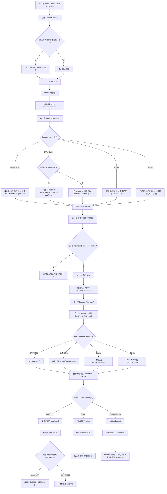

# 当前转账流程

本文基于当前代码实现梳理 Agentic Wallet 的转账流程，覆盖前端交互、后端路由、链上执行分支，以及当前接线下的几个关键行为差异。

## 1. 入口

当前转账入口有两种：

1. 钱包主页打开通用转账弹窗。
2. 资产详情页打开某个币种的转账弹窗。

差异：

- 钱包主页入口不预设资产，用户需要自己选链、填地址、填金额。
- 资产详情页入口会把当前资产的 `networkKey`、`tokenAddress`、`tokenSymbol`、`tokenDecimals` 作为预设传给转账弹窗；此时链路会锁定到该资产所在链，用户不能切链。

## 2. 用户侧流程

当前弹窗组件内部把转账拆成 5 个步骤：

1. `address`
2. `amount`
3. `review`
4. `waiting`
5. `result`

对应行为如下：

1. 用户进入转账弹窗。
2. 先填写收款地址。
3. 再填写金额。
4. 点击“Review Fee”后调用 `/v1/transfer/quote` 询价。
5. 询价成功后进入审费页，展示预计手续费、目标地址、金额、网络。
6. 点击 “Send” 后调用 `/v1/transfer/submit`。
7. 提交中时进入 `waiting`。
8. 请求返回后进入 `result` 成功/失败页。

需要注意两个当前实现细节：

- 这条链路里没有接支付二次验证，虽然项目里有 `verifyPaymentPasskey()` 和 `/v1/pay/verify/*`，但转账弹窗没有调用它。
- 在资产详情页入口里，`onSubmitted` 会直接关闭弹窗，所以成功后理论上的 `result` 成功页大概率不会真正展示出来；在钱包主页入口里则不会自动关闭，只会刷新资产列表。

## 3. 后端总流程

无论哪条链，后端主流程都分成两段：

1. `POST /v1/transfer/quote`
2. `POST /v1/transfer/submit`

`quote` 做的事：

1. 解析请求体。
2. 调用 `prepareTransfer()`。
3. 根据链类型生成一份 `PreparedTransfer`。
4. 把 `quote` 信息返回给前端，不落库。

`submit` 做的事：

1. 再次调用 `prepareTransfer()`，重新准备交易。
2. 先在 `UserAgentDO` 创建一条本地转账记录，初始状态为 `created`。
3. 调用 `sendPreparedTransfer()` 广播交易。
4. 广播成功后把本地状态更新成 `submitted` 并写入 `txHash`。
5. 调用 `waitForTransferReceipt()` 短暂等待链上结果。
6. 如果拿到最终成功，更新成 `confirmed`。
7. 如果明确失败，更新成 `failed`。
8. 如果超时仍未拿到最终结果，就返回 `submitted`，之后可通过 `GET /v1/transfer/:transferId` 再刷新状态。

## 4. 按链分支

### 4.1 EVM Token 转账

适用：Ethereum / Base / BNB 上的 ERC-20。

`prepareTransfer()` 中的处理：

1. 校验 `networkKey`、收款地址、代币地址。
2. 构建当前用户的钱包执行上下文：
   - 解密 EVM 私钥。
   - 创建 signer。
   - 创建 Biconomy multichain account。
   - 拿到当前链地址作为 `fromAddress`。
3. 决定代币精度：
   - 请求里有 `tokenDecimals` 就直接用。
   - 否则链上读 `decimals()`。
4. 把用户输入金额转成最小单位 `amountRaw`。
5. 链上读 `balanceOf(fromAddress)`，不足就报 `insufficient_token_balance`。
6. 选手续费代币：
   - 默认就是本次发送的代币自己。
   - 也支持请求里显式传 `feeTokenAddress` / `feeTokenChainId`。
7. 用 Biconomy account 构建 composable transfer instruction。
8. 先检查这个 fee token 是否被 MEE 支持。
9. 调用 `meeClient.getQuote()` 获取转账报价和 fee 信息。
10. 如果“发送代币”和“手续费代币”是同一币种，还会额外检查余额是否足够覆盖 `amount + fee`，并把结果写进 `insufficientFeeTokenBalance`。

`submit` 阶段：

1. 通过 `meeClient.executeQuote()` 发起 supertransaction。
2. 返回 `hash` 作为 `txHash`。
3. 再通过 `waitForSupertransactionReceipt()` 等待回执。

### 4.2 EVM Native Token 转账

适用：ETH / BASE / BNB 原生币。

`prepareTransfer()` 中的处理：

1. 校验网络和收款地址。
2. 解密用户钱包，拿到 `fromAddress`。
3. 把金额转成 `amountRaw`。
4. 查询原生币余额，不足就报 `insufficient_native_balance`。
5. 分两条子路：
   - 如果打开了 `MEE_SPONSORSHIP_ENABLED`，则走 MEE sponsored `nativeTokenTransfer`。
   - 否则走普通 EOA 直发交易。

MEE sponsored 路径：

1. 构建 `nativeTokenTransfer` instruction。
2. 调 `meeClient.getQuote({ sponsorship: true })`。
3. 提交时调 `meeClient.executeQuote()`。
4. 等待 supertransaction receipt。

普通 EOA 路径：

1. 用 `publicClient.estimateGas()` 和 `estimateFeesPerGas()` 估算手续费。
2. 构建 `walletClient.sendTransaction()` 请求。
3. 提交时直接发链上交易。
4. 用 `waitForTransactionReceipt()` 等 1 个确认，超时则先返回 `pending/submitted`。

### 4.3 Solana 转账

适用：SOL 原生币和 SPL Token。

`prepareSolanaTransfer()` 中的处理：

1. 找到用户的 Solana 地址。
2. 校验收款地址。
3. 如果是 SPL Token，解析 mint 地址并拿到 decimals。
4. 把金额转成 lamports / token raw amount。
5. 并发检查：
   - SOL 余额。
   - SPL 余额。
6. 如果主币余额或 token 余额不足，直接失败。
7. 调 `buildSignedSolanaTransfer()` 直接生成已签名交易和估算手续费。
8. 再额外检查 SOL 是否足够覆盖 network fee：
   - 发送 SOL 时要够 `amount + fee`
   - 发送 SPL 时要够 `fee`
9. 返回 `transactionBytes` 和 quote。

`submit` 阶段：

1. 直接广播已签名交易。
2. 返回 `signature` 作为 `txHash`。
3. 用 `waitForSolanaSignature()` 等结果。

### 4.4 Bitcoin 转账

适用：BTC 原生币，当前不支持 Bitcoin token transfer。

`prepareBitcoinTransfer()` 中的处理：

1. 如果请求里带 `tokenAddress`，直接报 `unsupported_bitcoin_token_transfer`。
2. 取出用户 BTC 地址和加密私钥。
3. 解密私钥，并重新推导一次 segwit 地址做一致性校验。
4. 校验收款地址。
5. 把金额转成 satoshi。
6. 从 `mempool.space` 拉：
   - 推荐 fee rate
   - 当前地址 UTXO
7. 选 UTXO，构建交易，自动算找零。
8. 对交易签名并 finalize。
9. 返回 `txHex`、`txId` 和 quote。

`submit` 阶段：

1. 把 `txHex` POST 到 `mempool.space/api/tx`。
2. 返回链上 txid。
3. 在 15 秒窗口内每 3 秒轮询一次状态。
4. 查到确认则 `confirmed`，404 则 `failed`，否则先返回 `submitted`。

## 5. 状态与记录

当前转账状态机是：

```text
created -> submitted -> confirmed
created -> failed
submitted -> failed
```

本地记录存放在 `UserAgentDO` 的 transfer 表里，用来支撑：

1. App 自己提交的转账历史。
2. 失败原因与 hash 追踪。
3. 幂等键去重。

历史接口 `GET /v1/transfer/history` 还会把本地记录和外部链上活动记录合并后返回，所以用户在资产详情页看到的 history 不只包含 App 主动发起的转账。

## 6. 当前完整流程图



## 7. 代码锚点

- 前端打开转账弹窗：
  - `apps/web/src/components/screens/WalletScreen.tsx`
  - `apps/web/src/components/screens/WalletAssetDetailScreen.tsx`
- 转账弹窗状态机与 UI：
  - `apps/web/src/components/modals/TransferContent.tsx`
- 前端 API：
  - `apps/web/src/api.ts`
- 转账路由：
  - `apps/api/src/routes/transfer.ts`
- EVM 主流程：
  - `apps/api/src/services/transfer.ts`
- Solana 分支：
  - `apps/api/src/services/solanaTransfer.ts`
- Bitcoin 分支：
  - `apps/api/src/services/bitcoinTransfer.ts`
- 支付 Passkey 二次验证（当前未接入转账）：
  - `apps/web/src/hooks/useWalletApp.ts`
  - `apps/api/src/routes/payment.ts`
